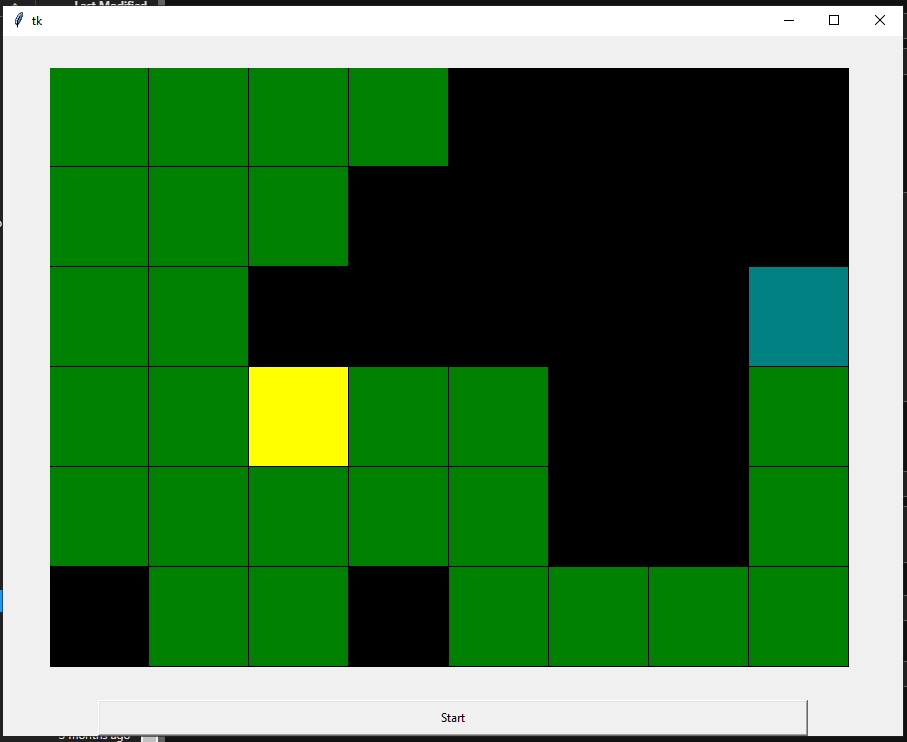

# Snake_Neural_Network
A small AI that learns to play snake with reinforcement learning.  

  
  

The nn used is a small, 3 layer, 291 x 1024 x 1 model.

**To briefly summarize what reinforcement learning is about:**  
  
- The ai creates its own training data instead on being trained on preexisting dataset.  
- Data comes from playing the game and consists of 2 tensors at every timestep - 1 representing current state and 1 representing previous state.  
- The game data is then scored by scoring functions and matched against the model's predictions during training.

**There are 2 different scoring functions used:**  
1.  the first one is a naive scoring that rewards moving towards food, used to kickstart training  
2.  the second one is standard reward with delay  

**The naive scoring is a simple algorithm:**  
- It only considers a single data point (current and previous tensors) and scores it based on whether the snake moves towards the food or not.  
if towards food : reward = 1, if away : reward = -1, if snake dies : reward = -5, if food eaten : reward = 10.

**After the model gets better, the scoring function switches to delay scoring:**  
The scoring then considers the entire length of the game and looks like:  
```
rewards = []  
for index, state in enumerate(list_of_game_states):  
    reward = 0
    for next_index in range(index, len(game)):  
        reward += gamma * math.pow(delay_value, next_index - index)   #where gamma = 0 if food not eaten, = 10 if food eaten, = -5 if snake dies  
    rewards.append(reward)
``` 
where delay_value is a hyperparamer and describes how much the model cares about what happens in the future.  


**Why have 2 different scoring systems?**  
  
The usual reward with delay is not very useful for the model when it is in it's infancy and is behaving randomly.  
Accurately predicting and scoring future actions (which is what scoring with delay does) of a randomly behaving model is not feasible and the labels end up close to meaningless.  
Let's say the model moves towards food - that's good right? But then the random behaviour causes it to die soon after and the initial correct move gets labeled with a negative value.  
Because of the randomness, and there being only one food versus many more ways to die, the model is much more likely to die and so the scores end up being dominated by the negative values.  
Using the naive scoring helps the model learn the baby steps and then the delay scoring can come in and assign values to a more structured behaviour where it makes much more sense.  

  
In training the delay went up to 0.998 as model plateaued repeatedly for lower values  

Learning rate started at 1e-2 and finished at 3e-5
